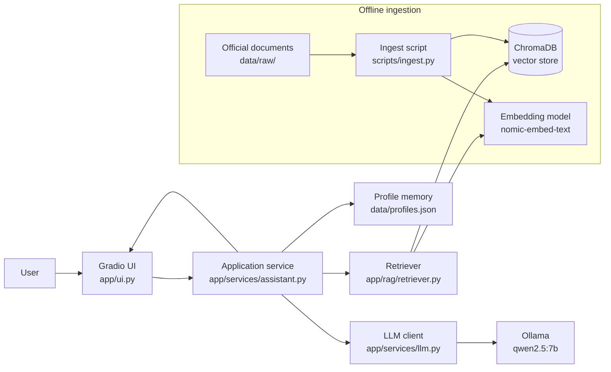

# Finland Bureaucracy Helper
An AI assistant that answers international students questions about Finnish bureaucracy (residence permits, DVV registration, Kela, tax card) using official documents, and shows the sources.

**Disclaimer:** This application provides general guidance only and is **not legal advice**. Always confirm with the official authority (Migri, DVV, Kela, Vero).

## 1. Team members

- Santosh Sigdel (santosh23000@student.hamk.fi, santosh.sigdel900@gmail.com)
- Puran karki (amk1002351@student.hamk.fi)
- Manoj Bhattarai (amk1006124@student.hamk.fi)
- Nabin Yari (amk1004480@student.hamk.fi)

## 2. Intended users and Problems 

### Intended users
International students, especially **non-EU students**, who are newly arrived or living in Finland and need to deal with Finnish authorities.
  
### Problem 
International students must complete many official processes, such as residence permits, address registration, Kela and tax cards. The information is spread across several government websites (Migri, DVV, Kela, Vero), International students must complete several official processes, often in a language they don't speak:

- Applying for and **extending a residence permit** (Migri)
- **Registering an address** and getting a **personal identity code** (DVV)
- Getting a **tax card** and understanding taxes when working (Vero)
- Understanding **Kela** benefits and eligibility
- Knowing **work-hour limits** for students

The information is **scattered across many official websites**, written in **long, formal language**, and often **depends on the student's situation** (EU or non-EU, permit type, length of stay). Students waste time, miss steps or rely on unreliable advice from social media groups.

### Main user need
"I want a quick, clear and **trustworthy** answer to my bureaucracy question that fits **my situation** and tells me **where the information comes from**.

## 3. Why AI is appropriate
- Students can ask questions in their own words. AI understands the meaning, not just keywords.
- AI summarises long official text into a short, clear answer.
- With RAG, answers come from official documents with sources, so the model doesn't make up rules.

## 4. proposed solution and main workflow
## Main workflow
1. The user (optionally) sets a **profile**: citizenship group (EU/EEA or non-EU), status (degree student or exchange student), city.
2. The user asks a question, e.g. _"Can I work while studying and how many hours?"_
3. The application **retrieves** the most relevant passages from the official document collection.
4. The model generates a **short, plain-language answer** using **only** those passages and the user's profile.
5. The answer is shown with **source citations** (document name + link).
6. If the documents don't contain the answer, the assistant **says so** and points to the right authority instead of guessing.

### Example
```
Profile: Non-EU, degree student, Hämeenlinna
Q: Do I need to register my address with DVV?

A: Yes. If you live in Finland for more than one year, you should register
   your Finnish address and get a personal identity code at DVV...
   Sources: [DVV – Registering as a foreign resident]
```

## 5. Architecture


### components
| Component | Responsibility |
|---|---|
| **UI (Gradio)** | Chat interface, profile settings, display of answers and sources. Contains **no AI logic**. |
| **Assistant service** | Orchestrates the workflow: validate input → load profile → retrieve → build prompt → call model → validate output |
| **Retriever** | Embeds the question and finds the top-k relevant chunks in ChromaDB |
| **Ingestion script** | Loads documents, cleans text, splits into chunks, creates embeddings, stores them with metadata (source, URL, title) |
| **LLM client** | Reusable wrapper around Ollama with timeouts, retries and error handling |
| **Profile memory** | Stores the user's situation (persistent JSON), so it doesn't need to be repeated |
| **Config** | All settings (model names, top-k, chunk size, Ollama URL) in `.env`, nothing hard-coded |

---

## Additional AI capability and justification

### Primary: Retrieval-Augmented Generation (RAG)
**Why:** The main challenge is **finding and correctly using official information**. Rules about permits and benefits are specific and change over time. RAG:
- keeps answers **grounded** in official documents instead of the model's memory,
- lets us show **citations**, which builds trust and lets users verify,
- lets us **update knowledge** by re-running ingestion, without retraining a model.

### Secondary: Persistent user profile (memory)
**Why:** Many answers depend on the user's situation (e.g. EU citizens don't need a residence permit but must register their right of residence). Remembering the profile gives **more relevant answers** and avoids repeating the same context.

### Not used: agents / MCP
The workflow is always the same (retrieve → answer), so an agent that decides its own next step would add complexity and risk without real benefit. Live web access via MCP was not chosen because we want answers to come from a **controlled, verified** document set.

---

### Capability justification
The LLM doesn't know the student's course materials, and the materials are too long to fit into a single prompt. **RAG** solves this problem: it retrieves only the relevant parts of the uploaded files and gives them to the model as context. This:
- keeps answers grounded in the actual course content and reduces hallucinations,
- lets the app show **which file and page** an answer came from, so students can verify it,
- works with any course, because students just upload new materials and no retraining is needed.

## 10. Setup and execution

### Prerequisites
- Python 3.10+
- [Ollama](https://ollama.com) installed and running
- ~6 GB free disk space for models

### 1. Clone the repository
```bash
git clone <your-repo-url>
cd <repo-folder>
```

### 2. Create a virtual environment and install dependencies
```bash
python -m venv .venv
# Windows
.venv\Scripts\activate
# macOS / Linux
source .venv/bin/activate

pip install -r requirements.txt
```

### 3. Download the models
```bash
ollama pull qwen2.5:7b
ollama pull nomic-embed-text
```

### 4. Configure
```bash
cp .env.example .env
```
Then edit `.env` if needed:
```env
OLLAMA_BASE_URL=http://localhost:11434
LLM_MODEL=qwen2.5:7b
EMBED_MODEL=nomic-embed-text
CHUNK_SIZE=800
CHUNK_OVERLAP=100
TOP_K=4
REQUEST_TIMEOUT=60
```
No API keys are required. **Never commit `.env`.**

### 5. Build the knowledge base
```bash
python scripts/ingest.py
```

### 6. Run the application
```bash
python -m app.main
```
Open http://localhost:7860 in your browser.

### 7. Run tests and evaluation
```bash
pytest
python evaluation/run_eval.py
```
## 11. Reliability and failure handling

<<<<<<< HEAD
| Situation | Behaviour |
|---|---|
| Ollama not running / model missing | Clear message: _"The AI model is unavailable. Please start Ollama."_ No crash. |
| Model timeout | Request is cancelled after `REQUEST_TIMEOUT`; user sees a retry message |
| Empty or too-long question | Input validation before calling the model |
| Question not covered by documents | The assistant says it cannot find the information and suggests the relevant authority |
| Off-topic question (e.g. weather) | Politely declines; explains the assistant's scope |
| Retrieval returns low-relevance chunks | A similarity threshold prevents answering from irrelevant text |
| Answer without citation | Output is checked; sources are always attached from retrieval metadata |
| Vector database missing | App tells the user to run `scripts/ingest.py` |
| Possibly outdated information | Every answer shows the disclaimer and links to the official page |
=======

## 12. Evaluation

### Approach
A set of **25–30 representative questions** in `evaluation/questions.json`, each with the expected key facts and expected source document.

| Category | Examples | What we check |
|---|---|---|
| Standard questions | "How do I extend my student residence permit?" | Correct answer, correct source |
| Profile-dependent | Same question for EU vs non-EU profile | Answer changes correctly |
| Not in documents | "What is the rent in Helsinki?" | Says "I don't know", no invented facts |
| Off-topic | "Write me a poem" | Declines politely |
| Tricky / ambiguous | "Can I work full-time?" | Mentions conditions (holidays vs term time) |
| 🔧 Failure cases | Ollama stopped, empty input | Controlled error message |

### Metrics
- **Retrieval hit rate:** is the expected source among the top-k retrieved chunks?
- **Answer correctness:** manually rated 0 / 1 / 2 (wrong / partial / correct)
- **Grounding:** does the answer contain claims that are not in the sources? (yes/no)
- **Correct refusal:** for unanswerable questions, does it decline instead of guessing?
- **Response time:** average seconds per answer

### Results
_To be completed. See `evaluation/results.md`._

| Metric | Result |
|---|---|
| Retrieval hit rate | _x / N_ |
| Correct answers | _x / N_ |
| Grounded answers | _x / N_ |
| Correct refusals | _x / N_ |
| Avg. response time | _x s_ |

---

## 13. Limitations

- **Not legal advice.** The assistant can be wrong or incomplete.
- **Static knowledge.** Documents are collected on a specific date; rules may change. Re-run ingestion to update.
- **English only.** Finnish and Swedish sources are not included.
- **Limited scope.** It covers common student processes only, not every immigration case (e.g. family ties, asylum).
- **Local model limits.** Smaller models may sometimes misread or oversimplify complex rules.
- **Single user.** The profile is stored locally; there are no user accounts.

---

